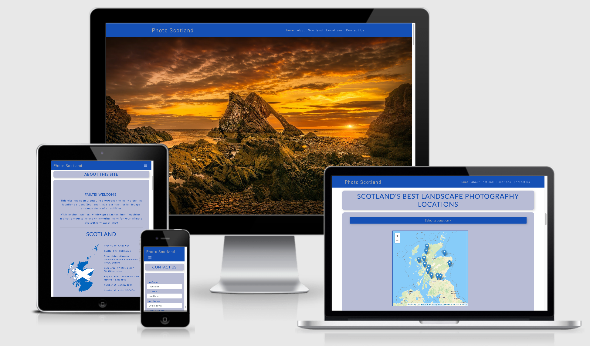
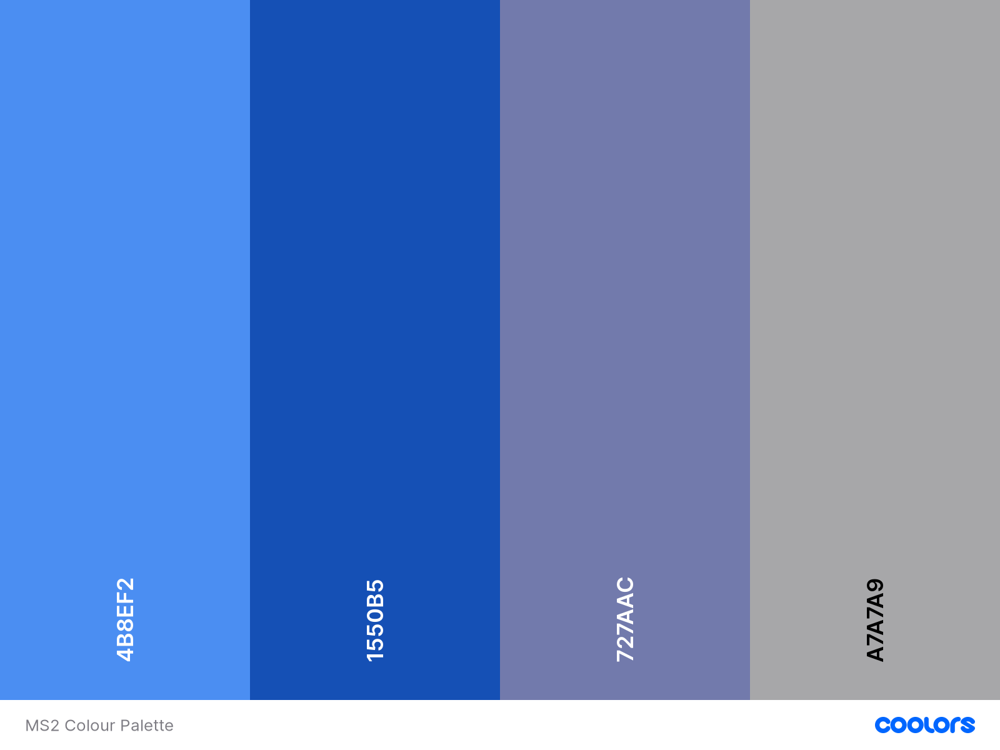

# Photo Scotland

[LIVE SITE ON GITHUB PAGES](https://sruss07.github.io/MS02_Photo_Scotland/

The purpose of this project is to highlight a selection of the best landscape photography locations in Scotland. The project can be scaled in the future by adding more locations and associated viewpoints.

### Table of Contents

> - [Overview](#overview)
> - [User Stories](#user-stories)
> - [UX](#ux)
> - [Features](#features)
> - [Technologies Used](#technologies-used)
> - [References for learning](#references-for-learning)
> - [Testing](#testing)
> - [Project barriers and solutions](#project-barriers-and-solutions)
> - [Code validity](#code-validity)
> - [Version Control](#version-control)
> - [Deployment](#deployment)
> - [Credits](#credits)
> - [Acknowledgments](#acknowledgments)
> - [Support](#support)

**Please note: To open any links in this document in a new browser tab, please press `CTRL + Click`.**

### Overview

> The purpose of this project is to highlight a selection of the best landscape photography locations in Scotland, and to promote tourism to these areas.

---

#### User Stories

> - _"I do all my online searches on my mobile"_
> - _"I do all my online searches on my tablet"_
> - _"I do all my online searches on my laptop or desktop"_
> - _"I want to know where are the best locations for landscape photography"_
> - _"I want to be able to join a mailing list about new locations"_
> - _"I want to make contact to ask questions about locations"_
> - _"I want to be able to join social media groups to communicate with others"_
> - _"I am interested in booking a trip and would like more information"_
> - _"I am interested in reading reviews before booking a trip"_

---

### UX

The website is targeted at photographers of all abilities. From professionals looking to enhance their portfolios, to experienced amateurs seeking new challenges. From new, inexperienced amateurs deciding on their favourite photography genre, to tourists who enjoy recording their vacations through their photography. The priority of the site is to focus on location information,images and maps and also to enable visitors to subscribe to a mailing list, complete a contact form and join related social media sites.

#### 1. Strategy

> The UX is user-friendly with a easy to follow navigation journey which allows the user to reach relevant sections and information with the minimum number of interactions with the site
>
> ##### Project Goals:
>
> - Showcase 12 of the most stunning landscape photography locations that Scotland has to offer.
> - Promoting Scotland as a must visit country for outstanding landscape photograpy.
> - To increse the numbers of visitors interested in visiting Scotland for landscape photography through subscriptions to mailing list and the consequent increase of the customer database.
> - Social media links to increase user interaction through Facebook, Twitter, Instagram, YouTube and Pinterest.
>
> ##### Customer Goals:
>
> - The site  has been designed with the Mobile-first approach at the forefront.
> - Interactive maps for each photography location with associated info panels.
> - Contact Us form with an option to sign up for mailing list.
> - Relevant social media icons in the footer linking to external sites.
> - Fixed navigation bar providing the site user easy, intuitive navigation links.

#### 2. Scope

> - Provides a clean and intuitive UX for users with easy navigation.
> - The content focuses on images and maps, subscribing to a mailing list and making contact via email and/or social media.
> - Demonstrates my current ability and knowledge of HTML, CSS, JavaScript and API use.

#### 3. Structure

> The structure is designed to allow users to find information relevant to their needs in efficient and easy manner.
> Location details are presented in short and relevant paragraphs to provide users with the required level of information.
> The site will utilise a set of high quality images to highlight each photography location.
> Introduction information for Scotland including population, capital city, other cities, land area, highest point, number of islands and number of lochs.
> Contact Us information is provided via email contact form with an optional newsletter subscription.
> Links to Facebook, Twitter, Instagram, YouTube and Pinterest social media websites in the fßooter.

#### 4. Skeleton

> - [Wireframes](https://github.com/sruss07/MS02_Photo_Scotland/blob/master/assets/docs/Photo%20Scotland%20wireframes.pdf): One-page website with **4** main sections.
> - Fixed navigation bar with link headings pointing to each of the 4 section.
> - Fixed navigation bar links headings collapse to menu icon on smaller screen sizes.
> - Home, About Scotland, Locations and Contact Us sections
> - Footer with social media icon links to Facebook, Twitter, Instagram, YouTube and Pinterest.

#### 5. Surface

> ###### Colours
>
> The site colours have been chosen to represent colours which are commonly associated with Scotland. The dark blue from the saltire flag, the lighte blue from Scotland's numerous lochs, purple from the heather clad glens and silver from the granite mountains. 
>
> 

> ###### Typography
>
> - "Barlow" font (with fall-back font of Serif) for main headings. This font was chosen for it's clean, modern appearance.
> - "Lato" font (with fall-back font of Sans-Serif) for the remaining site content. This font was chosen as it compliments the "Barlow" font and completes the overall appearance of the site.

> ###### Images
>
> The images have been selected to convey and showcase the amazing beauty of each location described on the website.

> ###### Maps
>
> Interactive maps with smooth zoom transitions to each location.
> Additional location information on map markers in the form of info panels.

---

### Features

##### Existing Features

> - The website was designed with HTML5, CSS3, JavaScript and Bootstrap.
> - Home/Landing page with scrolling capability between the 4 sections contained within the site.
> - The fixed navigation bar enables the user to easily navigate between each of the 4 sections.
> - The "About Scotland" section outlines the project objectives and provides the user with general information about Scotland.
> - The "Locations" section with links and interactive maps which zoom to each location. Markers on maps with information panels on markers.
> - Contact Us Form with radio buttons to allow users to contact with enquiries and subscribe to newsletter.
> - Footer with social media links to Facebook, Twitter, Instagram, YouTube and Pinterest.

##### Features Left to Implement

> - A gallery section would be desireable to further enhance the visual aspects of the site.
> - An automatic reply to users who subscribe to the newsletter would be a worthwhile addition.
> - With further coding knowledge I would like to be able to add a trip booking system to the site.
> - Scale the site further by adding additional locations.
> - Scale the site further by adding multiple viewpoints at each location.

---

### Technologies Used

##### 1. Languages

> [HTML5](https://en.wikipedia.org/wiki/HTML5) 
> * Coding language that is utilised to structure the overall content of the website.
>
> [CSS3](https://en.wikipedia.org/wiki/Cascading_Style_Sheets)
> * Coding language that is utilised to style the HTML5 elements in accordance with the font styles, colours and layouts selected.
>
> [JavaScript](https://en.wikipedia.org/wiki/JavaScript)
> * Programming language that is utilised to allow client-side script to interact with the user and make pages dynamic.

##### 2. Integration

> [Bootstrap](https://getbootstrap.com/) - by linking via [Bootstrap CDN](https://www.bootstrapcdn.com/) to HTML Doc.
>
> [FontAwesome](https://fontawesome.com/) - Source of icons for Social Media links in Footer.
>
> [Google Fonts](https://fonts.google.com/) - Source for overall Typography imports.
>
> [jQuery](https://jquery.com/) - JavaScript library
>
> [LeafletJS](https://leafletjs.com/) - Interative Maps API

##### 3. Workspace, version control and Repository storage

> [Git](https://git-scm.com/) - Version Control tool to store versions of files and track changes.
>
> [GitHub](https://github.com/) - Hosting service to manage my **Git** repositories.

##### 4. Other

> - [Autoprefixer](https://autoprefixer.github.io/) Parses CSS and adds vendor prefixes.
> - [Google Mobile-Friendly Test](https://search.google.com/test/mobile-friendly) Mobile-friendly check on site.
> - [Website Page Test](https://www.webpagetest.org/) Runs a website speed test from multiple locations around the globe using real browsers (IE and Chrome) and at real consumer connection speeds.
> - [Online-Spellcheck](https://www.online-spellcheck.com/) Online spelling and grammar checks.

##### 5. IDE Extensions used in GitPod

> - Auto Close Tag
> - Auto Rename Nametag
> - Bracket Pair Colorizer
> - Code Spellchecker
> - Prettier - Code Formatter
> - Indent-Rainbow

---

### Resources

> - [Code Institute Course Content](https://courses.codeinstitute.net/) - Main source of HTML, CSS and Javascript fundamental knowledge.
> - Code Institute **SLACK Community** - Main source of assistance
> - [Stack Overflow](https://stackoverflow.com/) - General resource.
> - [Youtube](https://www.youtube.com/) - General resource.
> - [CSS-Tricks](https://css-tricks.com/) - General resource.
> - [W3.CSS](https://www.w3schools.com/w3css/4/w3.css) - General resource.
> - [CommonMark](https://commonmark.org/help/) - Markdown language reference.
> - [Coolors](https://coolors.co/) - Color palette generation site.
> - [TinyPNG](https://tinypng.com/) - Compression of images for site.
> - [Am I Responsive](http://ami.responsivedesign.is/) - Responsive website mockup image generator.
> - [Figma](https://www.figma.com/) - Wireframe design tool.
> - [Bootstrap Grid Explanation by Anna Greaves](https://ajgreaves.github.io/bootstrap-grid-demo/) - An invaluable resource for understanding Grid layouts.
> - [LeafletJS](https://leafletjs.com/reference-1.7.1.html) - Interactive API map documentation

---

### Testing

> Testing documentation can be found on a separate document [HERE](https://github.com/sruss07/MS02_Photo_Scotland/blob/master/assets/docs/Testing.md)

### Project barriers and solutions

> - I encountered two barriers which slowed my overall progress, partly due to personal circumstances which affected the time I could devote to my project, and also due to my poor grasp of Javascript.
> - Firstly, I found getting the locations dropdown buttons to link to their associated information paragraphs to be troublesome. Writing a suitable javascript function for this to be a challenge. Due to personal circumstances which led to time restrictions, I was not able to complete this functionality as I was planning to.
 - Secondly, I had some problems with coding the maps API sections of my project to allow the maps to display in the correct way. The two things I wanted to implement were fixing the bounds of the map, and a zoom function to each marker. Again, due to the reason mentioned above I was unable to get the maps to behave exactly as I had planned.

---

### Code Validity

> HTML - [W3C](https://validator.w3.org/) - Markup Validation
>
> CSS - [W3C](https://jigsaw.w3.org/css-validator/) - CSS Validation
>
> JavaScript - [JSHINT](https://jshint.com/) - JavaScript code warning & error check
>
> TAGS - [Closing Tag Checker for HTML5](https://www.aliciaramirez.com/closing-tags-checker/) - Validates all tags are opened and closed correctly.

---

### Version Control

> -  Git was used for version control.

---

### Deploying My Project 

> I created my Milestone Project 2 on GitHub and used GitPod's development environment to write my HTML, CSS and Javascript code.

> All code was written on Gitpod. The code was then pushed to GitHub where it is stored in my [Repository](https://github.com/sruss07/MS02_Photo_Scotland).

> So that my project was viewable to others it was then deployed to GitHub Pages using the following process:

> 1. Opened the 'Settings' section of the project repository in GitHub.
> 2. Scrolled to the 'GitHub Pages' section.
> 3. Selected 'master branch' as the Source.
> 4. This deployed the project on GitHub Pages and thus enabled me to share the live website with others. 

> My live project can be viewed by folowing this link: [Photo Scotland]( https://sruss07.github.io/MS02_Photo_Scotland/.)

### Credits

> ##### Media
>
> - Intro carousel images from [Unsplash](https://unsplash.com/) and [Pexels](https://pexels.com/)
> - Scotland Map image from [Wikimedia](https://upload.wikimedia.org/wikipedia/commons/thumb/9/92/Flag_map_of_Scotland.svg/1200px-Flag_map_of_Scotland.svg.png)

>
> ##### Code Snippets
>
> - Button styling adapted from [Button Generator](https://www.bestcssbuttongenerator.com/#/11*)
> - Navigation bar adapted from [Bootstrap](https://getbootstrap.com/docs/4.0/components/navbar/)
> - Smooth scrolling (using Jquery) from [W3SCHOOLS](https://www.w3schools.com/howto/howto_css_smooth_scroll.asp)
> - HTML, CSS & JavaScript: Intro carousel & transition function from [CSS Tricks](https://css-tricks.com/snippets/jquery/simple-auto-playing-slideshow/)

---

> ##### Acknowledgments
>
> I would like to thank:
>
> - My mentor, **Gerry McBride** for his guidance and advice on this project before submission.
> - **CI staff** and **Slack Community** for always being on-hand with questions posted and assistance requests.
